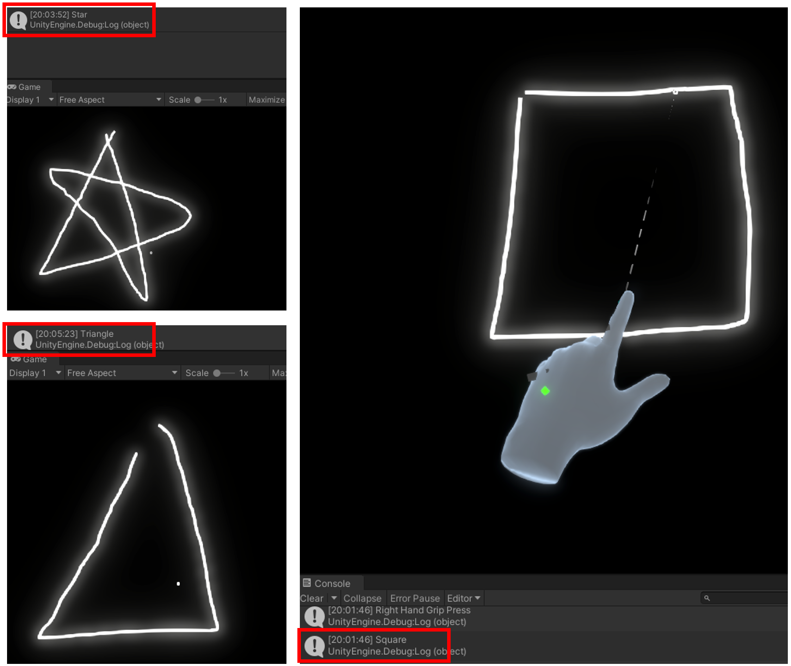

# Oculus Hand Tracking using MRTK(Mixed Reality Toolkit)
This repository is designed to use Oculus hand tracking using MRTK using MRTK and contains several hand tracking examples below.
1. Wizard System
2. TBA
3. TBA

now(2022-01-10)

## Requirements
> Add GRPC to Unity \
> 교체예정 https://shadabambat1.medium.com/basic-client-server-communication-using-unity-grpc-f4a3c2cf819c

> 참조 프로젝트 \ 
> 파이썬 모델

# Wizard System (Hand Tracking)

# TODO:
> 
1. 300x300을 width와 height 올바르게 저장되도록하기 (Done)
2. Left hand가 위로 상태, 아래로 상태 저장하기
3. Make possible to change left hand and right hand for both left-handed and right-handed people (Done)
4. Draw smooth line when changing the points to images (In-progress)
5. 서버로 이미지 전송, 응답 받기 (Done)
6. 도형 Classification (Done)
7. 데이터 쌓기
8. 라인 드로잉 완료 후 라인 지우기
9. 포스트 프로세싱 수정 및 손쪽 material 수정하기

# Releases:

